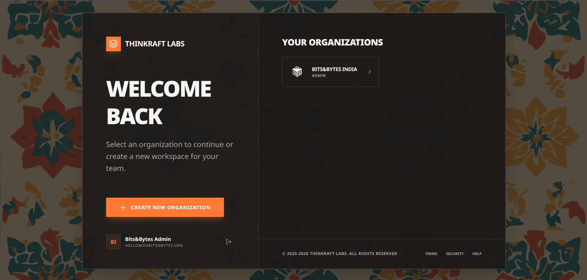
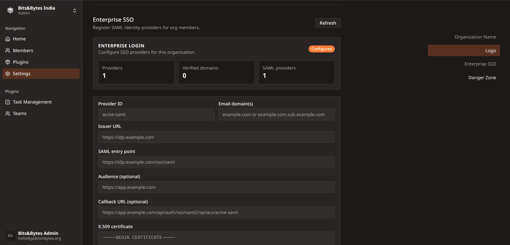
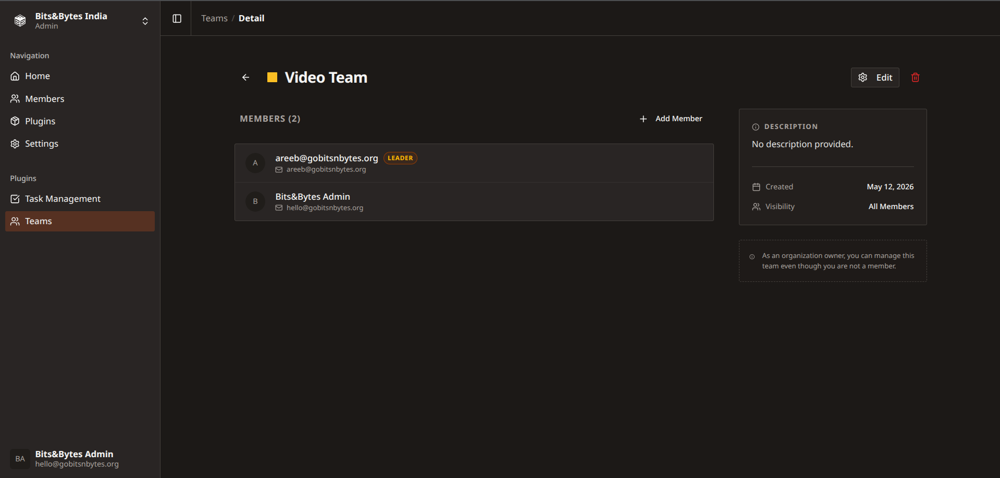
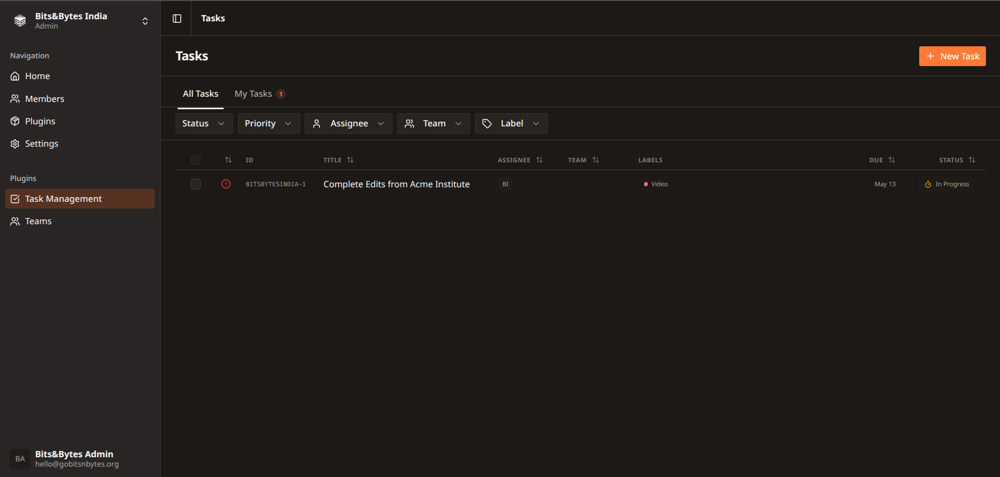
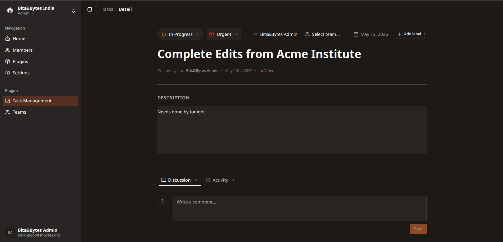

  
  
  # Club.
  
  ### by Thinkraft Labs
  
  *Day to Day Management tools for Student Orgs and Initiatives*
  ## Screenshots

<table>
  <tr>
    <td colspan="2" align="center">
      
    </td>
  </tr>
  <tr>
    <td align="center">
      
    </td>
    <td align="center">
      
    </td>
  </tr>
  <tr>
    <td align="center">
      
    </td>
    <td align="center">
      
    </td>
  </tr>
</table>

---

## What is Club?

Club is a multi-tenant SaaS platform for student-led organisations — clubs, dev communities, Model UNs, event teams. Each org gets its own isolated workspace with modular tools they actually need, without the bloat of enterprise software.

## Tech Stack

| Layer | Tech |
|---|---|
| Framework | Next.js 16 (App Router) |
| Language | TypeScript (strict) |
| Styling | Tailwind CSS v4 |
| UI | shadcn/ui + TweakCN |
| Auth | better-auth (org + stripe plugins) |
| ORM | Drizzle ORM |
| Database | Neon (PostgreSQL, serverless) |
| Hosting | Vercel |

 

## Architecture Highlights

**Multi-tenancy** — Every org is a fully isolated tenant. All data is scoped by `orgId` with no cross-org data bleed, enforced at the DB and server action layer.

**Plugin System** — Features ship as first-party plugins, each with its own DB tables, routes, and permissions. Plugins are plan-gated and toggled per org. A typed in-memory hooks registry (`lib/hooks/registry.ts`) enables loose coupling between plugins via events like `task:created`.

**No separate API** — Data flows entirely through Next.js Server Actions and Server Components querying Drizzle directly. No REST/GraphQL layer to maintain.

**Auth & Permissions** — Powered by `better-auth` with a three-tier role system (`Admin / Lead / Member`). Permissions enforced server-side on every mutation; UI layer reflects roles via `checkRolePermission` for progressive disclosure.

## Features

### Task Management
A Linear-inspired issue tracker built for orgs.

- Sequential human-readable identifiers (`ACM-42`, `DEV-10`) via atomic org-level counters
- Grouped board view by status (`Backlog → Todo → In Progress → Done`)
- Priority sorting (Urgent → Low) within groups
- Inline editing on title and description
- Full activity log: every status change, reassignment, and comment in one chronological feed
- Role-gated permissions (Members can't delete others' issues; Leads can't touch billing)

### Org Management
- Org creation with auto-generated slugs
- Invite by email
- Role management: Admin, Lead, Member
- Plugin settings per org

### Team Management
- Team Creation
- Team Management with a Leader system

  Built by <a href="https://thinkraft.studio">Thinkraft Labs</a>

